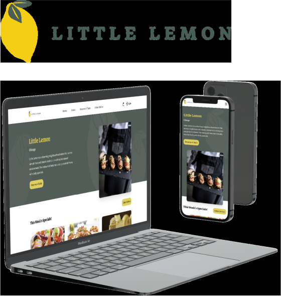

<br/>

Little Lemon is a modern, responsive restaurant web application that allows customers to explore the restaurant, reserve tables, and initiate online orders through a clean, intuitive interface.

Built with **React, Vite, and Tailwind CSS**, the project demonstrates real-world front-end architecture including client-side routing, component-driven design, responsive layouts, and production-ready build optimization.

End-to-end testing with Cypress ensures reliability of key user interactions and helps deliver a fast, accessible, and visually consistent experience across desktop and mobile devices.

**Live Demo:**  
https://littlelemon-517.pages.dev/

<br clear="left"/>

---

## Features

- Responsive landing page + modern UI layout
- Table reservation flow (UI/UX)
- Online ordering flow (UI/UX)
- Client-side routing with React Router
- End-to-end testing setup with Cypress

---

## Tech Stack


---

## Design & Planning

Wireframes and UI mockups were designed in Figma before development:

Figma: https://www.figma.com/design/9SetrepVetlaOQyZ4A6Ml1/Little-Lemon?node-id=12-262&t=4nEZCrR0S91SaVnm-1

---

## Getting Started (Local Setup)

1. Clone the repo
```bash
git clone https://github.com/Ms-Njuguna/LittleLemon.git
cd LittleLemon
```
2. Install dependencies
```bash
npm install
```
3. Run the app
```bash
npm run dev
```
4) Build for production
```bash
npm run build
```
6) Preview the production build
```bash
npm run preview
```

---

***Testing (Cypress)***
1. Open Cypress:
```bash
npx cypress open
```
2. Run headless:
```bash
npx cypress run
```

---
